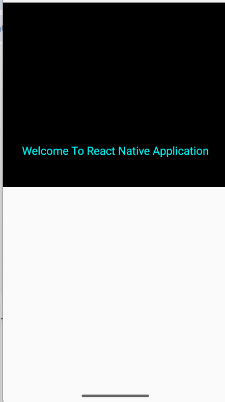
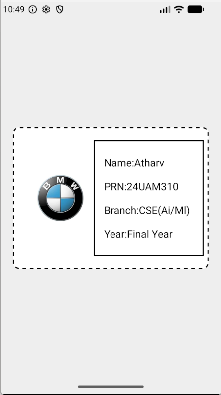
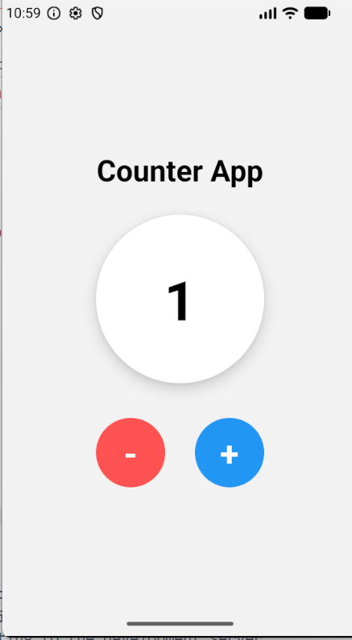
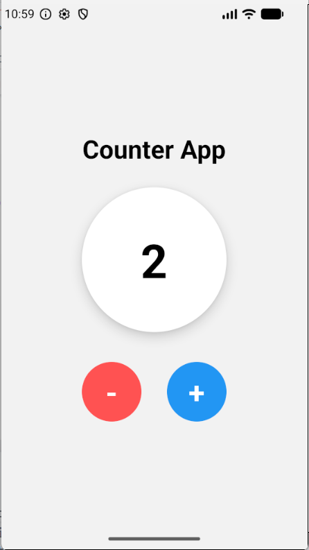

# 📘 React Native Assessment

## 3. Which command is used to create a React Native application?

To create a new React Native project, use the following command:

```bash
npx @react-native-community/cli init MyApp
```

This command creates the complete project structure, installs the required files, and prepares the application for development.

### Project Created

- Android folder
- iOS folder
- node_modules
- package.json
- App.tsx
- index.js

---

## 4. What is the purpose of the `android` folder?

The **android** folder contains all native Android source code and configuration files required to build and run the application on Android devices.

### It Contains

- Gradle build files
- AndroidManifest.xml
- Native Java/Kotlin code
- Resources (icons, strings, themes)

### Real-Time Example

Whenever you generate an APK or install the application on an Android phone, React Native uses the files inside this folder.

---

## 5. Why is the `ios` folder present in the project?

The **ios** folder contains the native iOS project used by Xcode. It is required to build and run the application on Apple devices.

### It Contains

- Swift/Objective-C source files
- Xcode project
- Assets
- Build settings

### Note

This folder is mainly used when developing or testing applications on macOS.

---

## 6. Which file represents the main screen?

The **App.tsx** (or **App.js**) file is the main UI screen of a React Native application. It is the first component displayed after the application starts.

### Purpose

- Design the application's interface.
- Add components like Text, Button, Image, and View.
- Manage application state and user interaction.

---

## 7. Difference between `package.json` and `package-lock.json`

### package.json

The **package.json** file stores project information, scripts, and dependency names. Developers can manually edit this file.

### package-lock.json

The **package-lock.json** file records the exact versions of installed packages. It is automatically generated by npm to ensure everyone installs identical dependencies.

| package.json | package-lock.json |
| :------------ | :---------------- |
| Stores project information. | Stores exact dependency versions. |
| Can be edited manually. | Generated automatically. |
| Defines required packages. | Ensures consistent installation. |

---

## 8. What is the use of the `node_modules` folder?

The **node_modules** folder contains all npm packages and libraries used by the project. It is automatically created after running `npm install`.

### Why is it Important?

- Stores third-party libraries.
- Required for building and running the application.
- Can contain thousands of files.

> Since this folder is very large, it is usually ignored using `.gitignore`.

---

## 9. Which file is the entry file of your application?

The **index.js** (or **index.ts**) file is the entry point of a React Native application. It registers the root component using `AppRegistry`.

### Responsibilities

- Starts the application.
- Loads the `App` component.
- Connects JavaScript with the native platform.

---

## 10. What is Metro Bundler? What is its use?

**Metro Bundler** is the default JavaScript bundler used by React Native. It compiles JavaScript code, bundles project files, and sends updates to the application during development.

### Features

- Fast Refresh support.
- Bundles JavaScript files.
- Detects code changes automatically.
- Optimized for React Native projects.

### Real-Time Example

When you save `App.tsx`, Metro automatically rebuilds the JavaScript bundle and refreshes the application without reinstalling it.

---

## 11. Which command is used to run the application on Android?

Run the following command:

```bash
npx react-native run-android
```

This command builds the Android application, installs it on a connected device or emulator, and launches the application automatically.

---

## 12. How do you verify that a physical device is connected?

Use the following command:

```bash
adb devices
```

This command lists all Android devices connected through USB or wireless debugging.

### Example Output

```bash
List of devices attached
RZ8N91XXXXX    device
```

If your device appears with the status **device**, it is successfully connected and ready for testing.

---

# 💻 Practical Programs

## 15. Change Text Color

### Output

<p align="center">
  
</p>

---

## 17. Change Background Color

### Output

<p align="center">
  
</p>

---

## 18. Create a Simple Student Card (Name, Roll No., Branch, Image)

### Output

<p align="center">
  
</p>

---

## 19. Create a Simple Counter UI

### Output

<p align="center">
  
</p>

<p align="center">
  
</p>

---