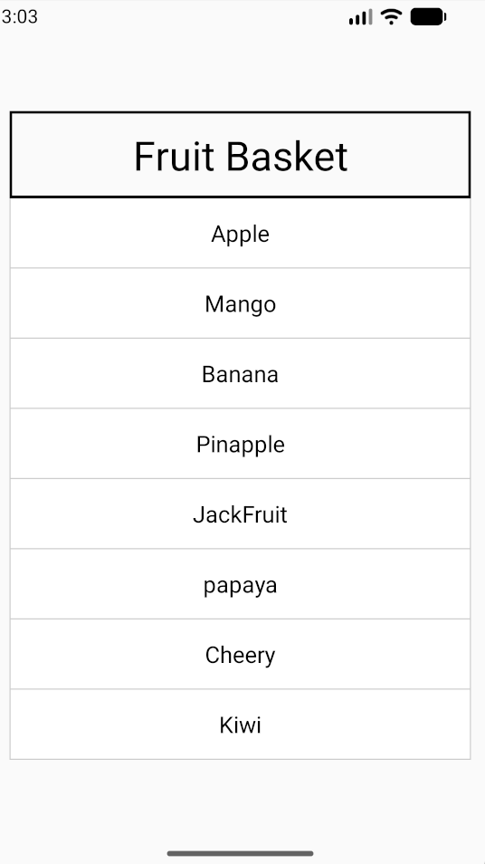
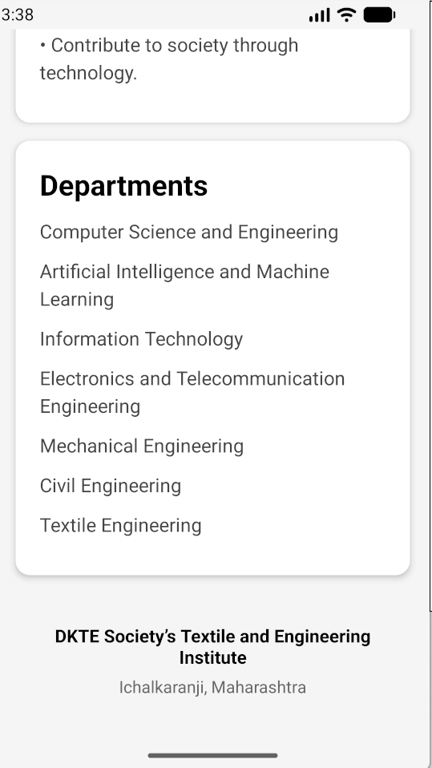

# React Native Practical – FruitList & About Page

## 1. Create FruitList using FlatList

<p align=center>

</p>
<!--  -->

---

## 2. Create About Page for College using ScrollView
<p align=center>

</p>
<p align=center>

</p>
<p align=center>

</p>

---

# Theory

## 3. Why do we use the `<View>` component?

`View` is the basic container component in React Native.

It is mainly used to:

- Group multiple components together.
- Create layouts.
- Apply styles such as padding, margin, width, height, and background color.
- Arrange components using Flexbox.

### Example

```jsx
<View style={styles.container}>
  <Text>Hello</Text>
  <Text>React Native</Text>
</View>
```

**Real-world example:** A `View` can act like a div container that holds a title, image, and button.

---

## 4. Difference between `<Text>` and `<View>`

| `<Text>` | `<View>` |
|---|---|
| Used to display text. | Used as a container/layout component. |
| Displays strings and text content. | Groups and arranges other components. |
| Supports text-specific styling. | Supports layout and container styling. |
| Used for headings, labels, paragraphs, etc. | Used for cards, sections, rows, containers, etc. |

### Example

```jsx
<View>
  <Text>Hello World</Text>
</View>
```

Here, `View` is the container and `Text` displays the content.

---

## 5. What is a StyleSheet?

`StyleSheet` is a React Native API used to define and organize styles for components.

```jsx
const styles = StyleSheet.create({
  title: {
    fontSize: 24,
    fontWeight: 'bold',
    margin: 10,
  },
});
```

It keeps styling separate from the component structure and makes the code easier to maintain.

---

## 6. Why do we use Flexbox?

Flexbox is used to create layouts and arrange components in React Native.

It helps us:

- Arrange items horizontally or vertically.
- Align items.
- Distribute available space.
- Create responsive layouts.

### Example

```jsx
<View style={{
  flexDirection: 'row',
  justifyContent: 'space-between',
}}>
  <Text>Left</Text>
  <Text>Right</Text>
</View>
```

**Real-world example:** Flexbox can arrange navigation buttons in a row or place items evenly inside a card.

---

## 7. What is the default Flexbox direction?

The default value of `flexDirection` in React Native is:

```text
column
```

Therefore, child components are arranged **vertically from top to bottom** by default.

```jsx
<View>
  <Text>Item 1</Text>
  <Text>Item 2</Text>
  <Text>Item 3</Text>
</View>
```

To arrange them horizontally:

```jsx
<View style={{ flexDirection: 'row' }}>
```

---

## 8. Difference between `justifyContent` and `alignItems`

Both are used for alignment in Flexbox, but they work on different axes.

| Property | Purpose |
|---|---|
| `justifyContent` | Aligns items along the **main axis** |
| `alignItems` | Aligns items along the **cross axis** |

For the default `flexDirection: 'column'`:

- Main axis → Vertical
- Cross axis → Horizontal

### Example

```jsx
<View
  style={{
    flex: 1,
    justifyContent: 'center',
    alignItems: 'center',
  }}
>
```

This places the child in the center both vertically and horizontally.

> **Easy trick:** `justifyContent` = main axis, `alignItems` = cross axis.

---

## 9. What is `flex`?

`flex` determines how much available space a component should occupy compared with its siblings.

```jsx
<View style={{ flex: 1 }}>
```

A component with `flex: 1` takes the available space.

### Example

```jsx
<View style={{ flex: 1 }}>
  <View style={{ flex: 1 }} />
  <View style={{ flex: 2 }} />
</View>
```

The available space is divided in a **1:2 ratio** between the two child views.

---

## 10. When do we use `ScrollView`?

`ScrollView` is used when the content is larger than the available screen and the user needs to scroll through it.

### Suitable for:

- About pages
- Terms and conditions
- Forms
- Articles
- Static pages
- Small or moderate amounts of content

### Example

```jsx
<ScrollView>
  <Text>Long content...</Text>
  <Text>More content...</Text>
</ScrollView>
```

**Important:** `ScrollView` renders all its children at once, so it is not ideal for very large lists.

---

## 11. When do we use `FlatList`?

`FlatList` is used to display a **large or dynamic list of items efficiently**.

### Suitable for:

- Product lists
- Chat messages
- Contact lists
- News feeds
- Student lists
- Fruit lists

### Example

```jsx
<FlatList
  data={fruits}
  renderItem={({ item }) => <Text>{item}</Text>}
  keyExtractor={(item, index) => index.toString()}
/>
```

---

## 12. Why is `FlatList` faster than `ScrollView` for large lists?

`FlatList` uses **virtualization**.

It does not render every item in a large list at the same time. It mainly renders the items currently needed on the screen and manages other items as the user scrolls.

### `ScrollView`

```text
1000 items
↓
All 1000 items rendered
```

### `FlatList`

```text
1000 items
↓
Only required/visible items rendered
↓
More items rendered as user scrolls
```

Therefore, `FlatList` generally uses less memory and performs better for large lists.

---

## 13. What makes a UI responsive?

A responsive UI adjusts itself according to different screen sizes and orientations.

In React Native, responsiveness can be achieved using:

- Flexbox
- `flex`
- Percentage-based dimensions
- `Dimensions`
- `useWindowDimensions`
- `ScrollView` / `FlatList`
- Flexible layouts instead of fixed sizes

### Example

```jsx
<View style={{ flex: 1 }}>
```

Using `flex: 1` allows the component to use the available screen space.

**Main idea:** Avoid depending heavily on fixed width and height values.

---

## 14. Why should we avoid inline styles?

Inline styles are not always bad, but they should generally be avoided for large or repeated styling because they can make code harder to read and maintain.

### Avoid

```jsx
<Text style={{ fontSize: 20, color: 'blue', margin: 10 }}>
  Hello
</Text>
```

### Use

```jsx
<Text style={styles.title}>
  Hello
</Text>
```

```jsx
const styles = StyleSheet.create({
  title: {
    fontSize: 20,
    color: 'blue',
    margin: 10,
  },
});
```

### Advantages of `StyleSheet`

- Cleaner TSX
- Better readability
- Reusable styles
- Easier maintenance
- Keeps styling separate from component structure

> Inline styles are perfectly fine for small, one-off dynamic styles. The main reason to avoid excessive inline styling is code organization and maintainability.
