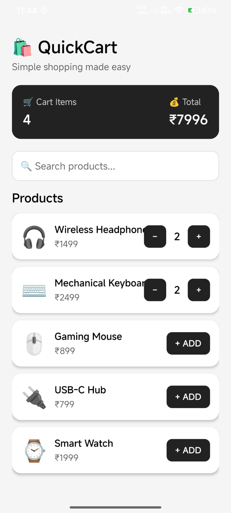

# 📘 React Native Assessment 5

## 1. Create a React Native Application Using Reusable Components

Create and use the following four reusable components in a single file/application:

* `CustomButton`
* `CustomCard`
* `CustomHeader`
* `CustomInput`

Use all four components together to build a simple application UI.

<p align=center>

</p>

---

# Theory

## 2. What are Reusable Components in React Native? Explain Their Benefits.

**Reusable components are components that are designed to be used multiple times in different parts of an application.**

**Instead of writing the same UI code repeatedly, we create a component once and reuse it wherever required.**

### Benefits of Reusable Components

* **Code Reusability:** The same component can be used multiple times.
* **Less Code Duplication:** Avoids writing the same code repeatedly.
* **Easy Maintenance:** Changes can be made in one component and reflected wherever it is used.
* **Consistency:** Keeps the UI design consistent throughout the application.
* **Better Organization:** Divides a large application into smaller and manageable components.
* **Faster Development:** Existing components can be reused to build new screens quickly.

### Example

```jsx
function CustomButton({ title }) {
  return <Button title={title} />;
}
```

**The `CustomButton` component can be reused multiple times with different titles.**

---

## 3. What are Props in React Native? Explain the Different Types of Props with Examples.

**Props (Properties) are used to pass data from a parent component to a child component.**

**Props are read-only, which means the child component should not directly modify the props received from its parent.**

### Different Types of Props

### 1. String Props

**String props are used to pass text values.**

```jsx
<CustomHeader title="Welcome" />
```

### 2. Number Props

**Number props are used to pass numeric values.**

```jsx
<CustomCard price={500} />
```

### 3. Boolean Props

**Boolean props are used to pass `true` or `false` values.**

```jsx
<CustomButton disabled={true} />
```

### 4. Array Props

**Array props are used to pass multiple values as an array.**

```jsx
<CustomCard items={["Apple", "Mango", "Banana"]} />
```

### 5. Object Props

**Object props are used to pass multiple related values as an object.**

```jsx
<CustomCard
  user={{
    name: "Atharv",
    age: 21,
  }}
/>
```

### 6. Function Props

**Function props are used to pass a function from a parent component to a child component.**

```jsx
<CustomButton onPress={() => console.log("Button Pressed")} />
```

---

## 4. How can Props be Passed from a Parent Component to a Reusable Child Component?

**Props are passed from a parent component to a child component by adding attributes to the child component.**

### Parent Component

```jsx
function App() {
  return (
    <CustomButton
      title="Login"
      color="blue"
    />
  );
}
```

### Reusable Child Component

```jsx
function CustomButton({ title, color }) {
  return (
    <Button
      title={title}
      color={color}
    />
  );
}
```

**Here, the parent component passes `title` and `color` as props to the `CustomButton` component.**

**The child component receives these props through its function parameters and uses them to display the required UI.**

### Flow

```text
Parent Component
       ↓
   Props Passed
       ↓
Reusable Child Component
       ↓
    UI Displayed
```

---

## 5. Explain How All Four Reusable Components Can be Used Together in a Single File.

**The four reusable components `CustomHeader`, `CustomInput`, `CustomCard`, and `CustomButton` can be created in the same file and then used together inside the main `App` component.**

### Example Structure

```jsx
function CustomHeader({ title }) {
  return <Text>{title}</Text>;
}

function CustomInput({ placeholder }) {
  return <TextInput placeholder={placeholder} />;
}

function CustomCard({ title }) {
  return <View><Text>{title}</Text></View>;
}

function CustomButton({ title }) {
  return <Button title={title} />;
}

export default function App() {
  return (
    <View>
      <CustomHeader title="My Application" />

      <CustomInput placeholder="Enter your name" />

      <CustomCard title="Welcome to React Native" />

      <CustomButton title="Submit" />
    </View>
  );
}
```

**In this application:**

* **`CustomHeader`** displays the application header.
* **`CustomInput`** provides an input field for the user.
* **`CustomCard`** displays information inside a card.
* **`CustomButton`** provides a button for user interaction.

**All four components work together to create a simple and reusable application UI.**

---
